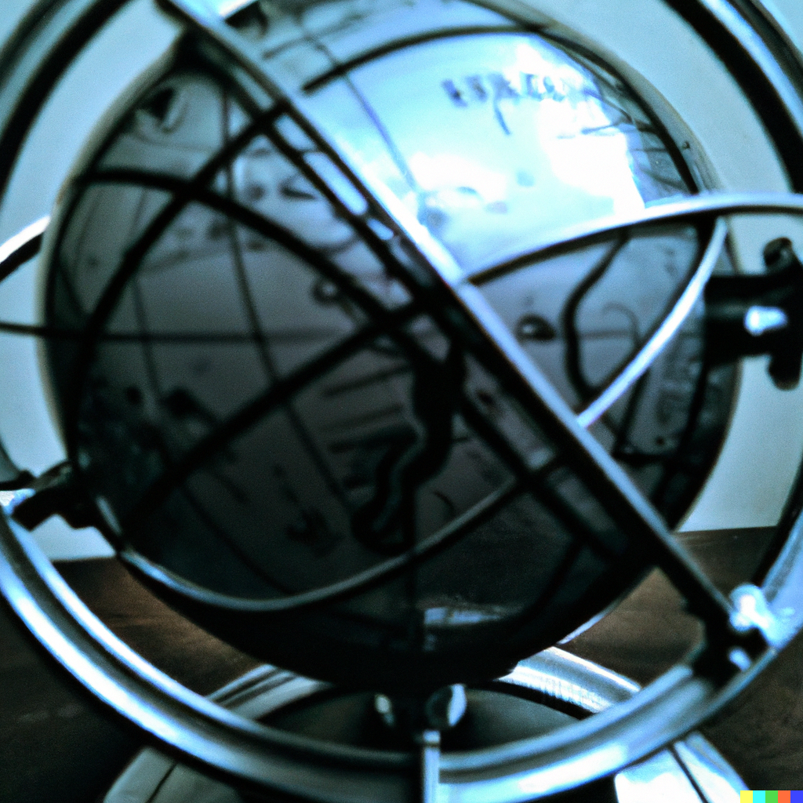
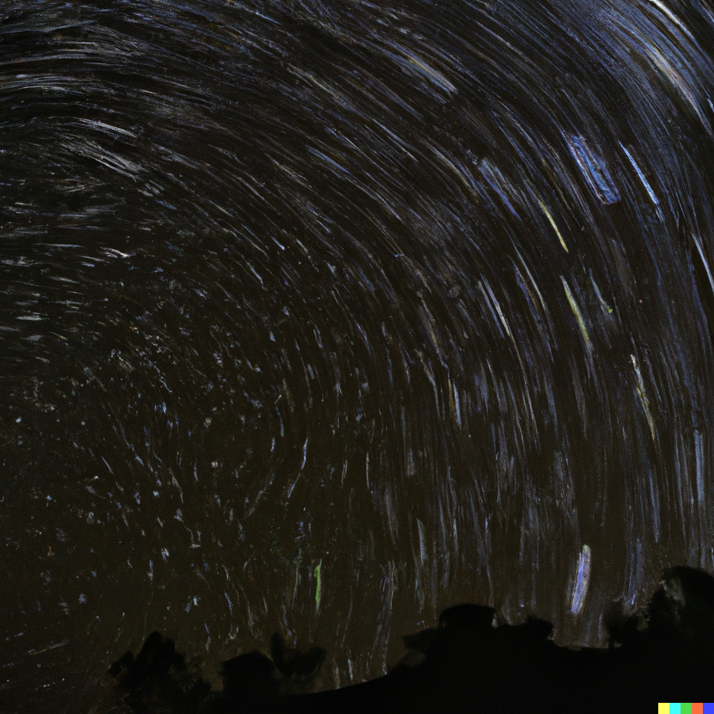
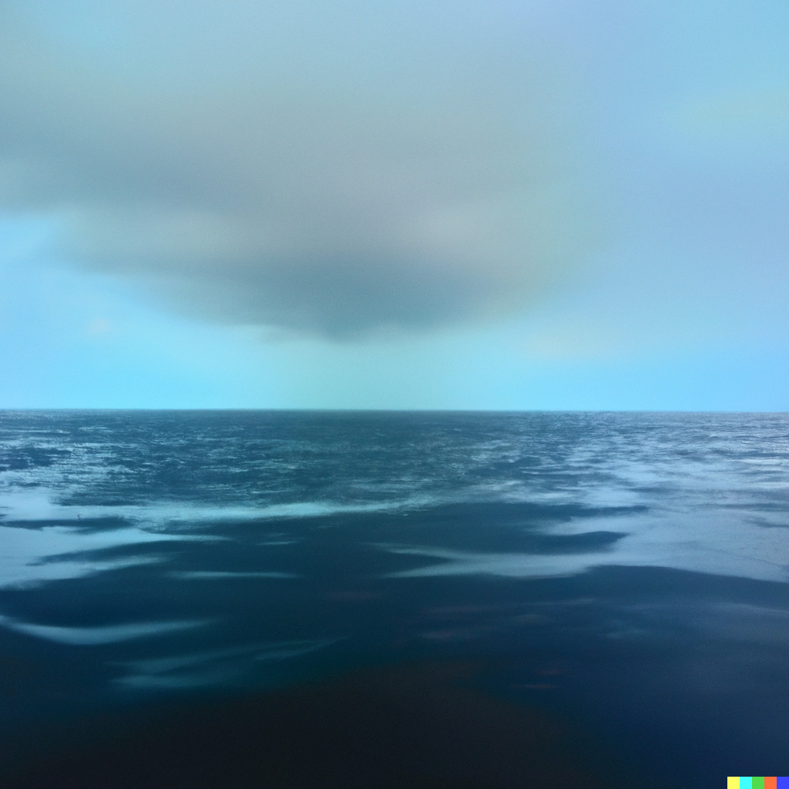
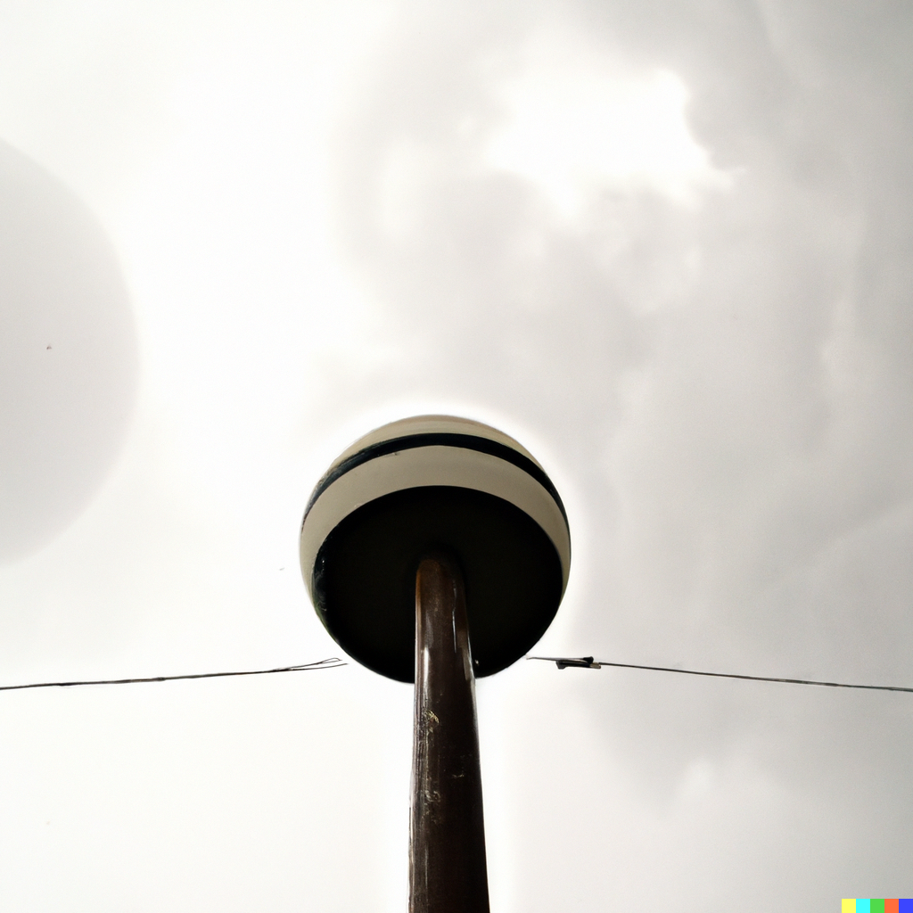

“At the still point of the turning world. Neither flesh nor fleshless;
Neither from nor towards; at the still point, there the dance is,
But neither arrest nor movement. And do not call it fixity,
Where past and future are gathered. Neither movement from nor towards,
Neither ascent nor decline. Except for the point, the still point,
There would be no dance, and there is only the dance.”

[A reading from TS. Eliot](https://soundcloud.com/brainpicker/t-s-eliot-reads-burnt-norton-1935)

